# 组件化开发
[输入链接说明](https://www.raywenderlich.com/17753301-creating-a-framework-for-ios#toc-anchor-016)
## Framework
#### 1. In Xcode, select File ▸ New ▸ Project…. Then choose iOS ▸ Framework & Library ▸ Framework.

#### 2.Click Next. Then set the Product Name to CalendarControl. Use your own Organization Name and Organization Identifier.

#### 3. Adding the Source Code to the Framework

#### 4.Select your project in the Project navigator and choose CalendarControl in Targets. Open the Build Settings. Then set Build Libraries for Distribution to yes. This produces a module interface file which shows your public API when someone jumps to definition of your module in Xcode.

#### 5.Build the framework project. Make sure you get Build Succeeded with no build warnings or errors.
#### 6.Access Control level
Swift has five levels of access control. Use the following rules of thumb when creating your own frameworks:
- Open and public: For code called by the app or other frameworks, such as a custom view.
- Internal: For code used between functions and classes within the framework, such as custom layers in that view.
- Fileprivate: For code used within a single file, such as a helper function that computes layout heights.
- Private: For code used within an enclosing declaration, such as a single class block and extensions of that declaration in the same file.
When CustomCalendarPicker was part of the XYGCalendarPicker app, internal access wasn’t a problem. Now that it’s in a separate module, you must make it public for the app to use it. You’ll do that in the next section.
Updating the Framework Access Level
Open CalendarPickerViewController.swift. Make the class public by adding the public keyword to the class definition, like so:

```
 public  class CalendarPickerViewController: UIViewController {

```
Now CalendarPickerViewController is visible to any app file that imports the CalendarControl framework.
Next, add the public keyword to:

```
CalendarPickerViewController.init(baseDate:selectedDateChanged:)
CalendarPickerViewController.init(coder:)
CalendarPickerViewController.viewDidLoad()
CalendarPickerViewController.viewWillTransition(to:with:)
CalendarPickerViewController.collectionView(_:numberOfItemsInSection:)
CalendarPickerViewController.collectionView(_:cellForItemAt:)
CalendarPickerViewController.collectionView(_:didSelectItemAt:)
CalendarPickerViewController.collectionView(_:layout:sizeForItemAt:)
```

Note: You might wonder why you have to declare init as public. Apple explains this and other finer points of access control in their Access Control Documentation.
#### 7. Edit target setting release
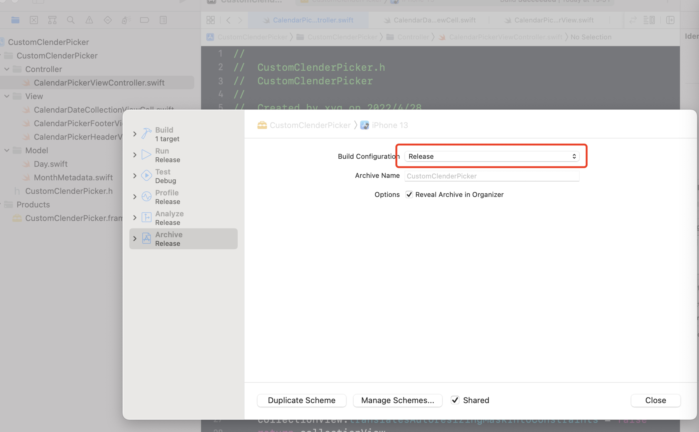
#### 8.Compile the simulator and generate the framework under the simulator environment under products
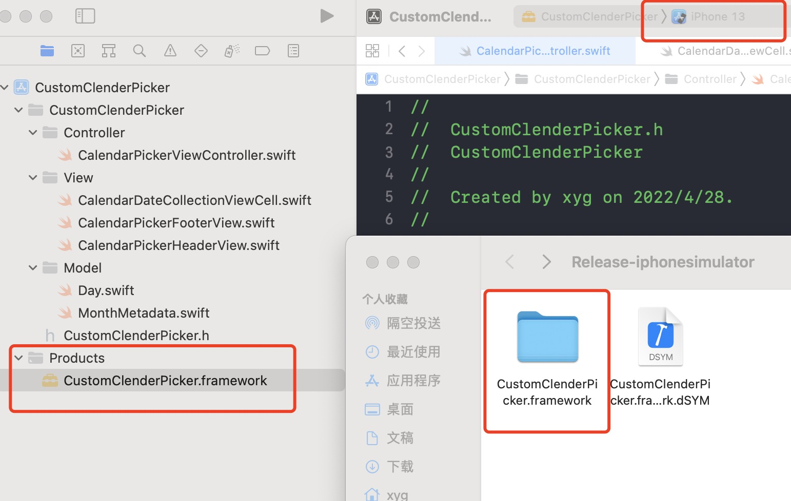
#### 9.Through the compilation of the device machine, the framework under the device environment is generated under products
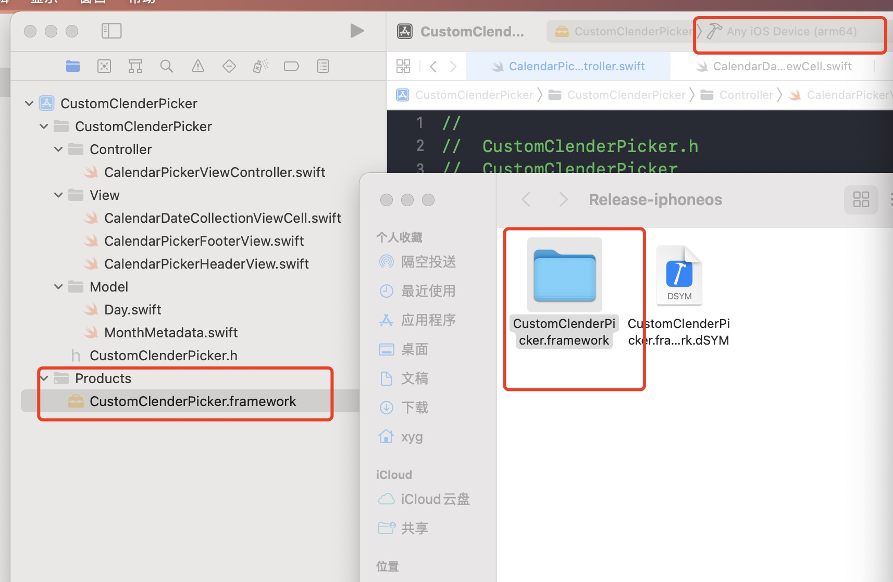
Build and run. Now you get your CustomCalendarPicker.
Congratulations! You now have a working stand-alone framework and an app that uses it!
#### 10. View the architecture information supported by the framework of simulators and devices
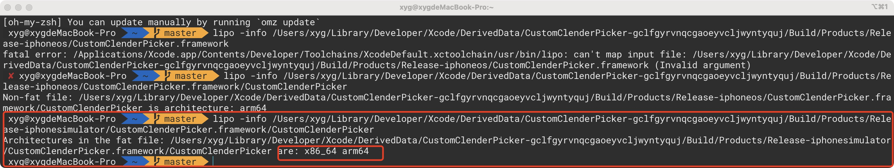
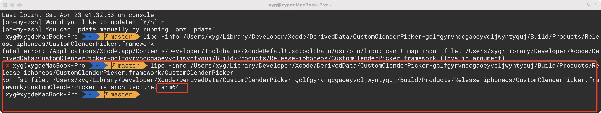
#### 11.Remove the simulator arm64 and only retain x86_64
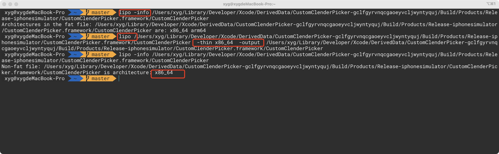
#### 12.Combine the simulator framework and the real equipment framework into a framework that supports both
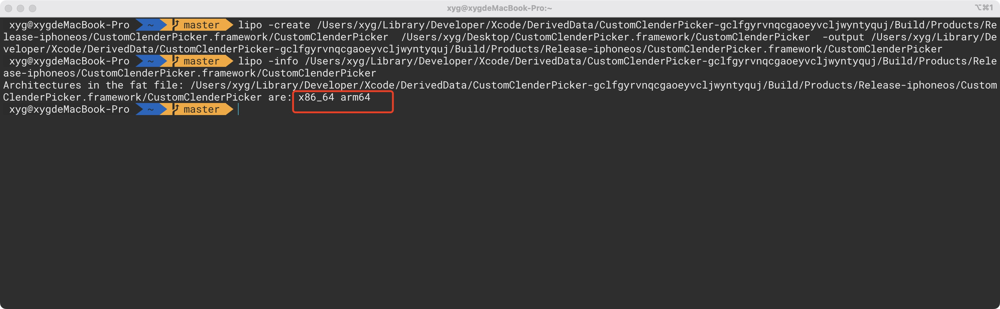
#### 13.congratulations! The framework is finished, and then give it to your partner to import, add and use
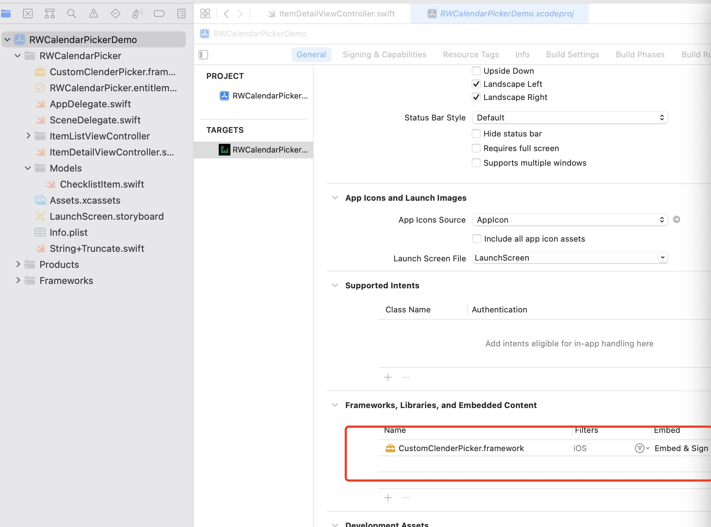

```
import CustomClenderPicker

```
#### 14.Display effect

## XCFramework
You might have heard about XCFramework during WWDC 2019. Yes, you’re right: This is the name of the binary framework you can generate with Xcode.
Before 2019, you only had one opportunity to make your own binary framework: Universal Static Library, also known as Fat Framework.
To support multiple architectures, like a simulator and devices, you had to combine them under one library in the fat framework. However, after this article, your frameworks don’t have to be fat anymore.
Archiving Your Framework
For this section, you’ll work with your old friend, Terminal. Woohoo!
Open your terminal and navigate to the framework folder with the following command. Alternatively, you could drag your project folder to your terminal after the cd command:
#### 1. Enter the root directory of the framework project file
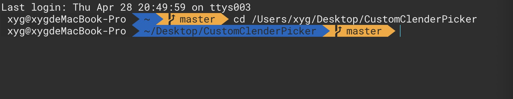

```
cd /Users/xyg/Desktop/CustomClenderPicker
```
#### 2. Next, start archiving your framework for the following targets:

- iOS
- Simulator
- macOS

Start with iOS. Enter the following command into the terminal:
#### 3. iOS device  xcodebuild

```
xcodebuild archive \
-scheme CustomClenderPicker \
-configuration Release \
-destination 'generic/platform=iOS' \
-archivePath './build/CustomClenderPicker.framework-iphoneos.xcarchive' \
SKIP_INSTALL=NO \
BUILD_LIBRARIES_FOR_DISTRIBUTION=YES

```
When it's done, it's like this：
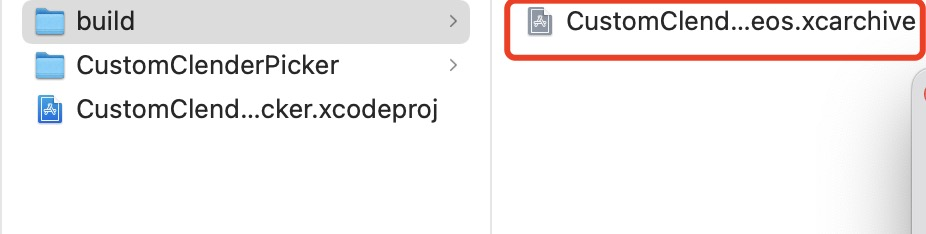
#### 4.Continue to complete the xcodebuild archive
Enter the following command into the terminal:

```
xcodebuild archive \
-scheme CustomClenderPicker \
-configuration Release \
-destination 'generic/platform=iOS Simulator' \
-archivePath './build/CustomClenderPicker.framework-iphonesimulator.xcarchive' \
SKIP_INSTALL=NO \
BUILD_LIBRARIES_FOR_DISTRIBUTION=YES
```
#### 5. MacOS xcodebuild
```
xcodebuild archive \
-scheme CustomClenderPicker \
-configuration Release \
-destination 'platform=macOS,arch=x86_64,variant=Mac Catalyst' \
-archivePath './build/CustomClenderPicker.framework-catalyst.xcarchive' \
SKIP_INSTALL=NO \
BUILD_LIBRARIES_FOR_DISTRIBUTION=YES
```
#### 6.As you can see in your finder and the following screenshot, you generate three different archives files from your framework.
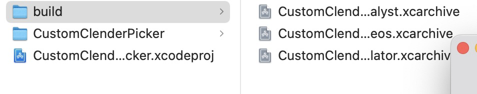
#### 7.Generating the XCFramework
Now, make the binary framework, XCFramework. Add the following command to the terminal:

```
xcodebuild -create-xcframework \
-framework './build/CustomClenderPicker.framework-iphonesimulator.xcarchive/Products/Library/Frameworks/CustomClenderPicker.framework' \
-framework './build/CustomClenderPicker.framework-iphoneos.xcarchive/Products/Library/Frameworks/CustomClenderPicker.framework' \
-framework './build/CustomClenderPicker.framework-catalyst.xcarchive/Products/Library/Frameworks/CustomClenderPicker.framework' \
-output './build/CustomClenderPicker.xcframework'
```
If this error occurs：

```
No 'swiftinterface' files found within '/Users/xyg/Desktop/CustomClenderPicker/build/CustomClenderPicker.framework-iphonesimulator.xcarchive/Products/Library/Frameworks/CustomClenderPicker.framework/Modules/CustomClenderPicker.swiftmodule'.
```


you need to set the build library for distribution of the framework project
 **在 Build Settings ~> Build Library for Distribution 设为YES** 
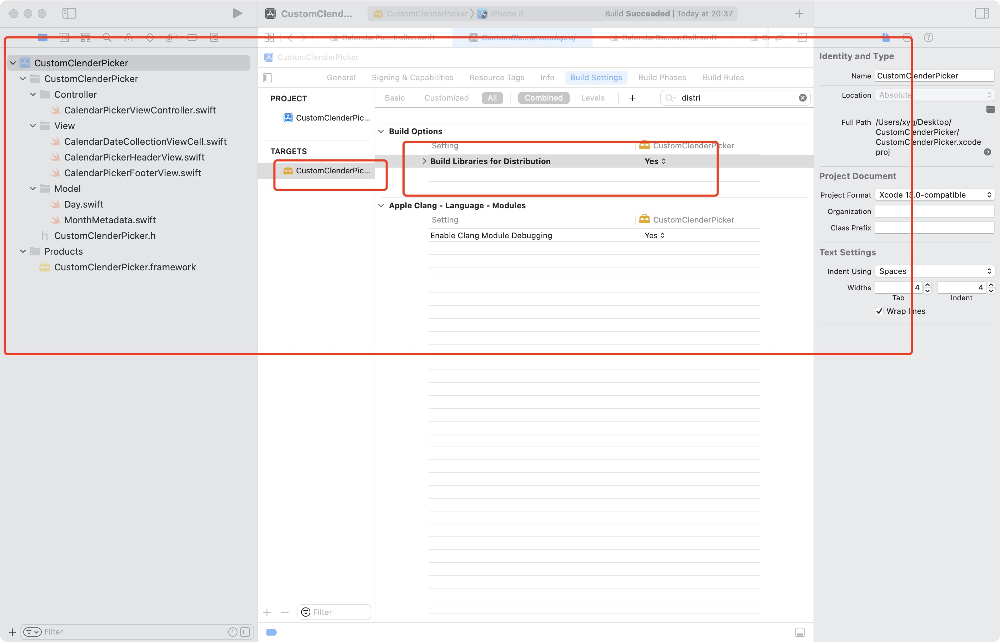
#### 8.Check the build folder to see what the XCFramework includes.
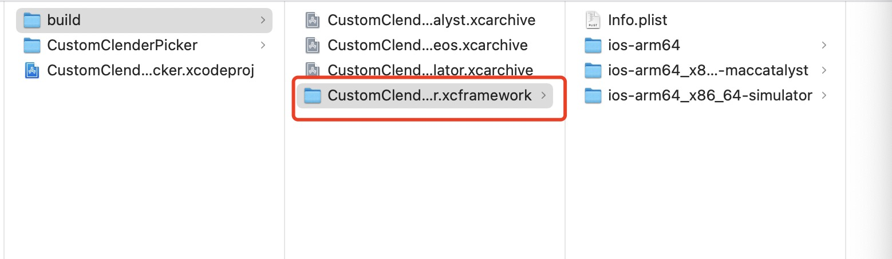
#### 9.Boooooom! You’ve now made your first XCFramework. and then give it to your partner to import, add and use


```
import CustomClenderPicker

```
#### 10.Display effect

## Cocopods
Distributing CustomClenderPicker.XCFramework as a cocoapods
CocoaPods is a bit more strict and requires you to keep the built binaries with the Podspec
#### 1.create CustomClenderPicker.podspec file

```
pod spec create CustomClenderPicker
```
#### 2. fill content of podspec
At the root of the project, create the following CustomClenderPicker.podspec. In this spec we're not publishing actual code, so we don't have to specify which files are applicable. Instead, we must use the vendored_frameworks property to indicate which XCFramework(s) need to be published.
```
Pod::Spec.new do |spec|
  spec.name               = "CustomClenderPicker"
  spec.version            = "1.0.2"
  spec.summary            = "CustomClenderPicker Library for iOS apps"
  spec.description        = "CustomClenderPicker Library for iOS apps. time picker to select time"
  spec.homepage           = "https://gitee.com/xiyg/projects"
  spec.documentation_url  = "https://gitee.com/xiyg/custom-clender-picker"
  spec.license            = { :type => "MIT" }
  spec.author             = { "xiyg" => "xyg15243228311@163.com" }
  spec.source             = { :git => 'https://gitee.com/xiyg/custom-clender-picker.git', :tag => "#{spec.version}" }
  spec.swift_version      = "5.3"

  # Supported deployment targets
  spec.ios.deployment_target  = "13.0"

  # Published binaries
  spec.vendored_frameworks = "Sources/CustomClenderPicker.xcframework"
  # spec.dependency 'PromisesSwift', '1.2.8' # Third Party Dependency

end
```
#### 3. commit and set tag 1.0.0

```
git add .

git commit -m ""

git push

git tag "0.0.1"

git push --tags
```

#### 4. validate .podspec upload to remote repo

```
pod spec lint CustomClenderPicker.podspec --allow-warnings
```
#### 5. if validate passed

#### 6.register and upload tococopods

```
pod trunk register xyg15243228311@163.com 'xiyg' --description='CustomClenderPicker is a tool'
```
#### 7.open you email and click links

#### 8.scan validate email is secures or not

```
pod trunk me
```

#### publish to cocopods

```
pod trunk push CustomClenderPicker.podspec
```

#### 9.congratulations! your cocopods  is finished, and then give it to your partner to import, add and use

```
pod search CustomClenderPicker
```
if occur error like this:

```
 ~  pod search CustomClenderPicker
[!] Unable to find a pod with name, author, summary, or description matching `CustomClenderPicker`
```
#### 10.open terminal input following command in the terminal:

```
rm ~/Library/Caches/CocoaPods/search_index.json
```
then:

```
pod setup
pod search CustomClenderPicker
```

## Swift Package Manager
Distributing CustomClenderPicker.XCFramework as a Swift Package
At WWDC 2020, Apple announced that you can easily distribute your XCFramework within Swift Packages. Isn’t that awesome?
Note: If you’re not familiar with Swift Packages or Swift Package Manager you can find out more by reading Swift Package Manager for iOS.
You should have a Swift Package for distributing your XCFramework. You’ll create one in the next section. Then you can share your fancy framework by publishing it on GitHub.
Preparing the Swift Package
Note: If you’re not familiar with Swift Packages or Swift Package Manager you can find out more by reading [Swift Package Manager for iOS](https://www.raywenderlich.com/7242045-swift-package-manager-for-ios).
#### 1. add Package.swift file

```
import PackageDescription

let package = Package(
    name: "CustomClenderPicker",
    platforms: [
      .macOS(.v10_15), .iOS(.v14), .tvOS(.v14)
    ],

    products: [
        // Products define the executables and libraries a package produces, and make them visible to other packages.
        .library(
            name: "CustomClenderPicker",
            targets: ["CustomClenderPicker"]),
    ],
   
    targets: [
      .binaryTarget(
        name: "CustomClenderPicker",
        path: "./Sources/CustomClenderPicker.xcframework")
    ]

)

```
#### 2. mkdir dir Sources and  copy CustomClenderPicker.xcframework to Sources
```
.
├── LICENSE
├── Package.swift
├── README.en.md
├── README.md
└── Sources
    └── CustomClenderPicker.xcframework
```
#### 3.create repostity on gitee.

#### 4.clone respotity to sourcetree add package file to gitee

#### 5.commit and set tag 1.0.0

#### 6.Boooooom! You’ve now made your first swift package. and then give it to your partner to import, add and use
#### 7. give it to your partner to use file->add package ,input:https://gitee.com/xiyg/custom-clender-picker.git

#### 8. import to your project to use

## Cartthage
Carthage 是一款 iOS 项目依赖管理工具，与 Cocoapods 有着相似的功能，可以帮助你方便的管理第三方依赖，它会把三方依赖编译成 framework ，以 framework 的形式将三方依赖加入到项目中进行使用和管理
[如何使用carthage](https://www.raywenderlich.com/7649117-carthage-tutorial-getting-started#toc-anchor-009)

